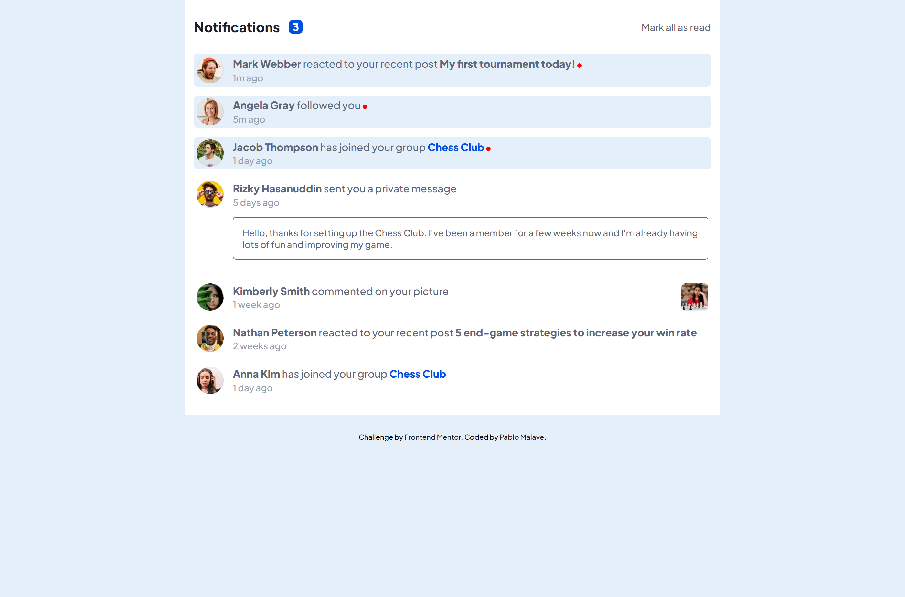

<!-- Please update value in the {}  -->

<h1 align="center">Notification Page</h1>
<h2 align="center">with Vue.js</h2>

<div align="center">
   Solution for a challenge from  <a href="http://frontendmentor.io" target="_blank">FrontEnd Mentor</a>.
</div>

<div align="center">
  <h3>
    <a href="https://03-interior-consultant-master.vercel.app/">
      Demo
    </a>
    <span> | </span>
    <a href="https://github.com/pablomalave/03.interior-consultant-master.git">
      Solution
    </a>
    <span> | </span>
    <a href="https://www.frontendmentor.io/challenges/notifications-page-DqK5QAmKbC">
      Challenge
    </a>
  </h3>
</div>

<!-- TABLE OF CONTENTS -->

## Table of Contents

- [Overview](#overview)
  - [Built With](#built-with)
- [Features](#features)
- [Contact](#contact)
- [Acknowledgements](#acknowledgements)

<!-- OVERVIEW -->

## Overview




This webpage shows a list of Notifications of an Application:

- Distinguish between "unread" and "read" notifications
- Select "Mark all as read" to toggle the visual state of the unread notifications and set the number of unread messages to zero
- View the optimal layout for the interface depending on their device's screen size
- See hover and focus states for all interactive elements on the page


### What I learned

The use of forEach() method to calls a function for each element in an array.

```js
const notificationsUnread = document.querySelectorAll(".notification--unread");
    notificationsUnread.forEach(removeClass, "notification--unread");

 function removeClass(item) {
    item.classList.remove(this);
}   
```
With the second argument in the forEach() method, a value passed to the function as its this value.

### Built With

<!-- This section should list any major frameworks that you built your project using. Here are a few examples.-->

- HTML, CSS, CSS Grid, CSS Flex.
- JavaScript.
- Mobile First Design.
- Responsive Design.

## Features

<!-- List the features of your application or follow the template. Don't share the figma file here :) -->

This application/site was created as a submission to a [FrontEnd Mentor](https://www.frontendmentor.io/challenges) challenge. The [challenge](https://www.frontendmentor.io/challenges/notifications-page-DqK5QAmKbC) was to build an application to complete the given user stories.

## Acknowledgements

<!-- This section should list any articles or add-ons/plugins that helps you to complete the project. This is optional but it will help you in the future. For exmpale -->

- Chris Coyer. [A Complete Guide to Flexbox. ](https://css-tricks.com/snippets/css/a-guide-to-flexbox/) 2013 - 2021.
- Chris Coyer. [A Complete Guide to Grid. ](https://css-tricks.com/snippets/css/complete-guide-grid/) 2013 - 2021.
- Thu Nghiem[Steps to replicate a design with only HTML and CSS.](https://devchallenges-blogs.web.app/how-to-replicate-design/) 2020.
- W3 Schools. [HTML DOM Document addEventListener()](https://www.w3schools.com/jsref/met_document_addeventlistener.asp)
- W3 Schools. [How TO - Remove a Class](https://www.w3schools.com/howto/howto_js_remove_class.asp)
- W3 Schools. [JavaScript Array forEach()](https://www.w3schools.com/jsref/jsref_foreach.asp)
- W3 Schools. [JavaScript HTML DOM Elements](https://www.w3schools.com/js/js_htmldom_elements.asp)


## Contact

- Website [Pablo Malave - GithubPages](https://pablomalave.github.io/CV/)
- GitHub [@pablomalave](https://github.com/pablomalave)
